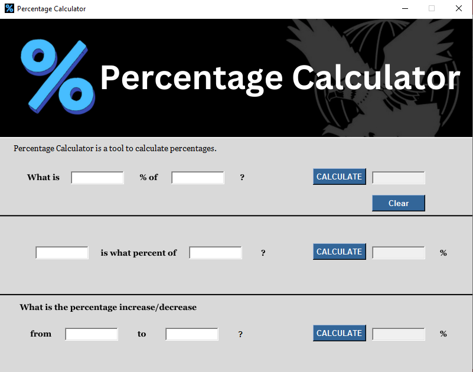

# Percentage Calculator
**Creator:** Paul Mendoza   
**Created on:** January 12, 2025    
**Connect with Me:**   
* Facebook: [Paul Mendoza](https://www.facebook.com/mypaulmendoza/)
* Instagram: [Paul Mendoza](https://www.instagram.com/mypaulmendoza/)
  
A simple Percentage Calculator application by falcon built using Python and Tkinter. This tool helps to calculate percentages in three different modes:

1. **Calculate Percentage of a Value**
2. **Calculate Percentage from Part and Total**
3. **Calculate Percentage Increase/Decrease**
## Features
* Mode 1: Calculate percentage of a given value (e.g., 20% of 150).
* Mode 2: Calculate the percentage of a part relative to the total (e.g., what percentage is 40 out of 200?).
* Mode 3: Calculate the percentage increase or decrease between two values (e.g., increase from 50 to 60, what percentage increase is that?).
* Input validation to ensure correct data types.
* Simple, clean, and intuitive graphical user interface using Tkinter.
## Requirements
* Python 3.x (tested with version 3.12.7)
* Tkinter (comes bundled with Python)
* Icon and background images are required (can be found in the images/ directory).
## Installation
1. Clone or download this repository:

       https://github.com/paulmendoza24/Percentage-Calculator.git
       cd Percentage-Calculator
3. Ensure you have Python installed (3.x recommended). You can check your Python version with:

       python --version
4. Run the application by executing the following command in the terminal:

       python main.py
## Screenshots
  
## Usage
* Enter values in the provided input fields.
* Select the appropriate mode (1, 2, or 3) to calculate the percentage.
* Click "CALCULATE" to get the result.
* Click "Clear" to reset the input fields.
## Error Handling
The application includes basic error handling to ensure users input valid numbers. If an invalid value is entered, the input field turns red, indicating an error.
## Contributing
1. Fork this repository.
2. Create a new branch (`git checkout -b feature-branch`).
3. Make your changes and commit them (`git commit -am 'Add new feature'`).
4. Push to your forked repository (`git push origin feature-branch`).
5. Create a pull request.
